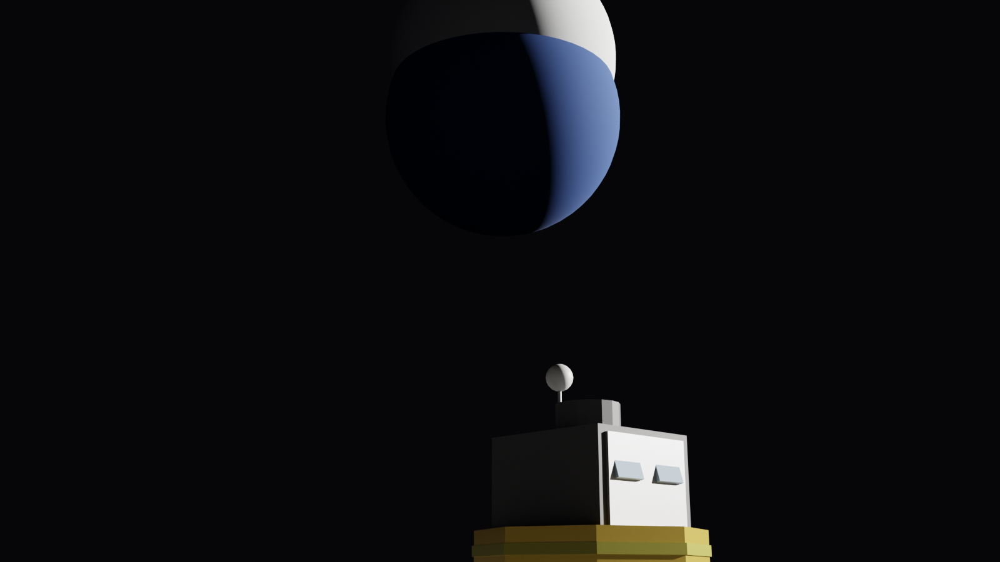
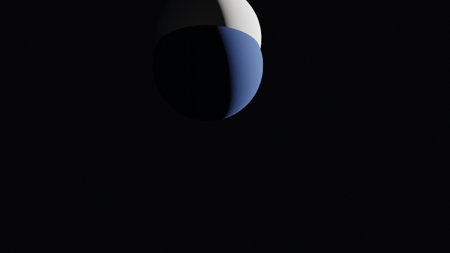

# 🌒 touchdown-cinema

**EN:** The landing. [`lander-cinema`](https://github.com/efealtiparmakoglu/lander-cinema)'s suicide-burn integrator, replayed in real time on [`terrain-cinema`](https://github.com/efealtiparmakoglu/terrain-cinema)'s crater field. The last six seconds are the simulation itself — throttle, gimbal and altitude all read straight from the ODE, and the regolith spray starts only at the exact contact frame because the Moon has no air to carry dust before that. Blue Earth fills the background; shadows cut to the terminator.

**TR:** İniş. lander-cinema'nın suicide-burn entegratörü, terrain-cinema'nın krater tarlasında gerçek zamanda oynatılıyor. Son altı saniye simülasyonun kendisi: gaz, gimbal ve irtifa doğrudan ODE'den; regolit spreyi yalnızca tam temas karesinde başlar — çünkü tozu taşıyacak hava yok. Mavi Dünya arka planı dolduruyor, gölgeler terminatöre kadar kesiliyor.



## 🖼️ Gallery / Galeri

### 💥 Dokunma

t = 0.4 s after contact: engine dark, regolith sheets radiating out, Earth behind. — *Temastan 0.4 s sonra: motor sus, regolit yaprakları dışa yayılıyor, arkada Dünya.*

### 🎬 İniş animasyonu

*48 frames of the final six seconds — 50 m up at 1 m/s down, ending in the dust sheet. No easing curves: every frame is the integrator.*

## 🧱 How it works / Nasıl çalışır

```
lander-cinema/fizik.inis_sim()  →  h(t), throttle(t), temas_t
        ↓  son 6 saniye oynatilir
terrain-cinema/krater  →  krater mesh (merkez temiz)
        ↓
lander.kok.z = h(t) her karede; temas sonrasi ballistik toz
   (ay atmosferi yok -> toz yatay duser, yukari kalkmaz)
```

## ✅ Verification / Doğrulama

```bash
python3 tests/verify.py
```

- **Touchdown gates**: v_z = 1.00 < 2, u = 0.39 < 0.5 m/s (inherited physics, re-checked)
- **Window gate**: the 6-second replay starts at 50.7 m altitude
- **Landing-zone gate**: 12 craters, none within 12 m of touchdown point
- **Zero-altitude gate**: final z = 0 exactly

## 🚀 Usage / Kullanım

```bash
# kardeş repolar yan yana olmalı
git clone https://github.com/efealtiparmakoglu/lander-cinema
git clone https://github.com/efealtiparmakoglu/terrain-cinema
git clone https://github.com/efealtiparmakoglu/touchdown-cinema

blender --background --python inis.py -- --scene scenes/dokunma.json
HIZLI=1 blender --background --python inis.py -- --scene scenes/dokunma.json
blender --background --python inis.py -- --scene scenes/inis.json --gif 48 --fps 12
```

## 🧪 Why / Neden

**TR:** Bütün serinin en kısa fiziği, en ağır kararı içerir: bir saniye geç yanlışsa çakılırsın, bir saniye erken yakıtsız kalırsın. Bu repo o kararın sonucunu göstermek için var — 50 metreden 1 m/s'le, yüzde 96 yakıtla, tozun içinden. Render, denklemin gölgesi.

## 📄 License

MIT
